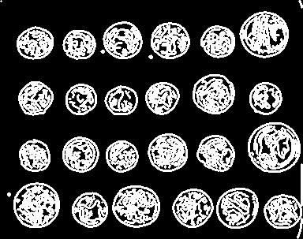
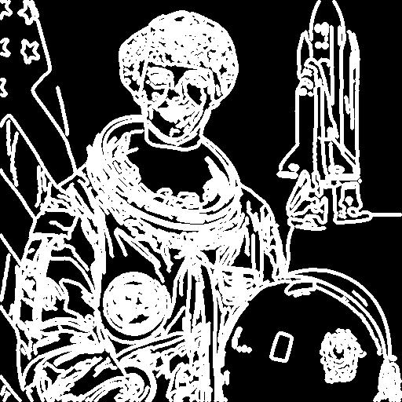
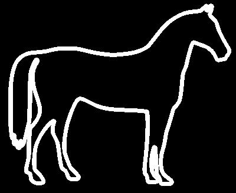

# Optimized resize of binary images

Реализация nearest neighbour interpolation для ресайза бинарных изображений на Numpy.


**Подготовка среды (python 3.10.8)**:
```commandline
pip install -r requirements.txt
```

**Генерация бинарных изображений для теста**:

 ```
python src/utils/generate_images.py
 ```

**Запустить программу**:

 ```
python src/main.py <path_to_input_img> <img_width> <img_height> --mode [naive, vectorized]
 ```

**Тестирование скорости работы**:

```commandline
python src/test.py
```


---
### Примеры работы

#### Исходное изображение №1 (303x384)

 

- [размер 156x178](tests/images/resized/1%5B156,%20178%5D.jpg)
- [размер 512x584](tests/images/resized/1%5B512,%20584%5D.jpg)


#### Исходное изображение №2 (512x512)

 

- [размер 256x256](tests/images/resized/2%5B256,%20256%5D.jpg)
- [размер 1024x1024](tests/images/resized/2%5B1024,%201024%5D.jpg)


#### Исходное изображение №3 (328x400)

 

- [размер 112x112](tests/images/resized/3%5B112,%20112%5D.jpg)
- [размер 400x400](tests/images/resized/3%5B400,%20400%5D.jpg)